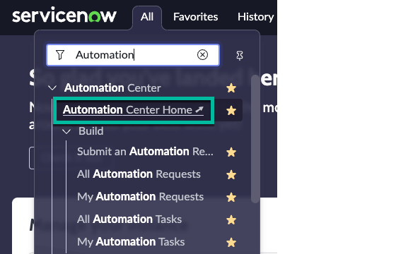
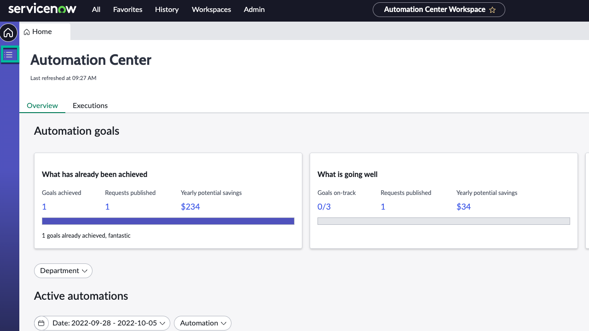
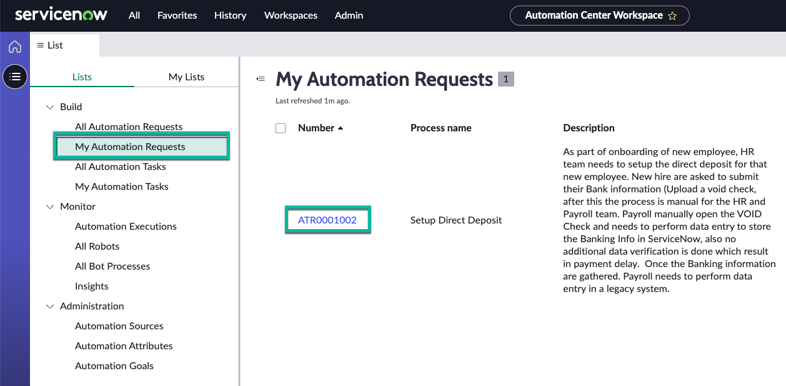
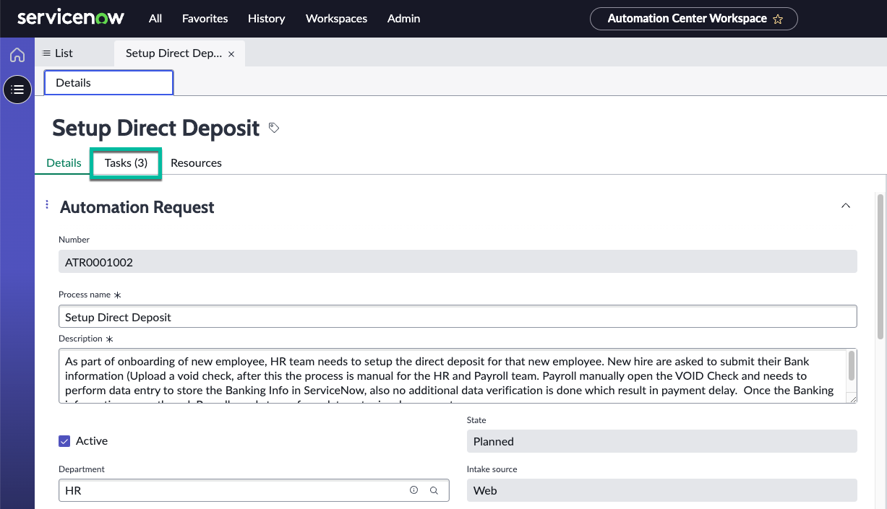
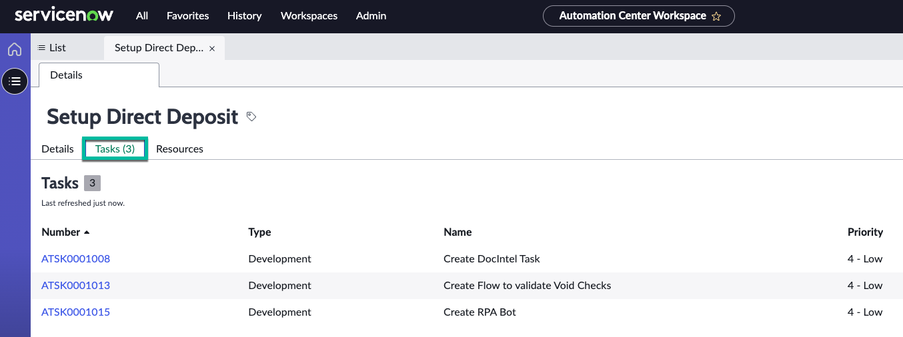
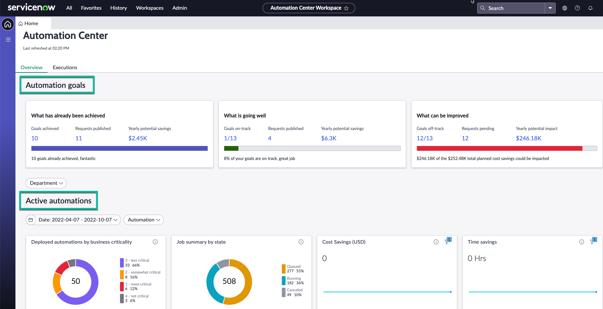
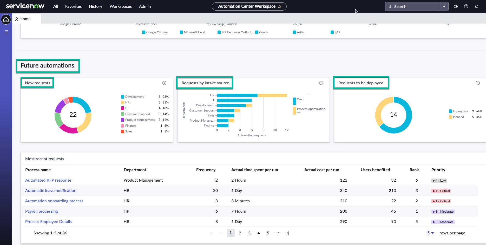

# Automation Center

# Introduction

Automation Center is used as a Central repository to manage all automations across any vendor intelligently on a single platform. It is also used to monitor the entire hyperautomation landscape on a single platform and integrate islands of automation from multiple vendors into one cohesive whole at the cross- enterprise level to maximize automation business impact.

# Goal

In this lab you will gain an understanding of ServiceNow’s Automation Center offering to help drive the various activities at an Automation CoE (Center of Excellence). You will get familiarity with:
1. Creation of Automation requests, Tasks and Resources.
2. How to fetch metadata from Automation Center Workspace.

## Steps
<!-- Replace this section with the goals of your lab/workshop -->

1. Login to the Service Now instance (running on Tokyo version)
2. Navigate to Automation Center dashboard/landing page.

3. Goto the list view

4. Goto My Automation Request and click on the Automation Request ID.

5. Now you can see the Automation request # ATR0001002 (Setup Direct Deposit) created from Service Catalog.
To see the Tasks associated with the Automation Request please click on the Tasks TAB as shown in the screenshot.

6. Now you can see the 3 Automation tasks associated with the Automation Request # ATR0001002 to fullfill the request.

# Automation Center Workspace

Lets take a look at the various components of the Automation Center Workspace.

## Automation Goals and Active Automations

## Future Automations

1. New Requests
2. Requests by intake source
3. Requests to be deployed.

